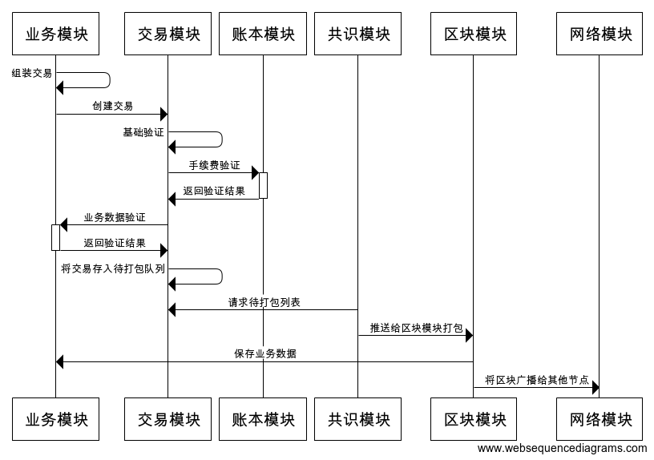
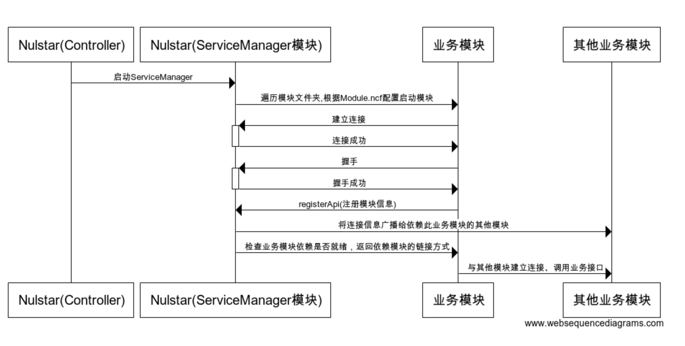

# NULS ChainBox
## NULS ChainBox是什么

ChainBox是一个快速搭建区块链的工具，封装了账本，账户，交易，区块，共识，网络六个底层模块，屏蔽了分布式数据存储、点对点传输、共识机制、加密算法等复杂区块链技术，开发者可使用它实现分钟级搭建TPS达1000的基础链，或根据标准通信协议开发业务模块，然后通过chainbox驱动组成一条全新的应用链

## 为什么需要ChainBox
 NULS ChainBox设计的初衷是帮助企业或应用开发者在区块链上能快速构建应用，并专注自己的业务实现，无需关心晦涩、复杂的区块链底层技术。


## 特点
NULS ChainBox本质上是NULS2.0的一个扩展应用，它的定位是一站式区块链开发平台，它有3个核心特点：

- 快速搭建开发环境

- 通过模板降低应用开发门槛

- 通过约定和脚本降低模板集成的难度，实现一键生成可运行程序

## 快速体验
在下面这个case中，你将体验到如何使用NULS ChainBox快速构建一套提供加密邮件服务的区块链应用

### 1 环境准备

- linux内核的操作系统
- 安装 Git
- 安装Maven
- 安装JDK11

### 2 获取NULS ChainBox

打开终端，执行以下命令

```
git clone https://github.com/nuls-io/nuls-chainbox.git chainbox
```
### 3 构建加密邮件模块
执行命令进入example目录

```
cd example   #进入示例文件夹
```
执行命令构建模块

```
./package    #执行构建脚本（模板提供）
```

看到以下输出后，说明构建完成

```
============ PACKAGE FINISH 🍺🍺🍺🎉🎉🎉 ===============
```

构建成功后会在example中生成outer文件夹

> PS:如果你想知道该模块是如何设计的，请查看[加密邮件模块设计文档](./example/模块设计文档.md)

### 4 集成加密邮件模块
回到chainbox根目录

```
cd ..
```

执行命令，集成加密模块到NULS2.0运行环境中

```
./tools -p example
```
看到以下输出后，说明集成成功

```
============ PACKAGE FINISH 🍺🍺🍺🎉🎉🎉 ===============
```

完成后在chainbox目录下会生成NULS-WALLET文件夹，此文件夹包含了集成了加密邮件模块的NULS2.0运行程序

若在不同机器部署了多个节点，建议修改NULS-WALLET/.default-config.ncf配置文件中的以下两个参数

```
#最小链接节点数,当链接到的网络节点低于此参数时,会持续等待
minNodeAmount=0
#种子节点出块地址
seedNodes=tNULSeBaMkrt4z9FYEkkR9D6choPVvQr94oYZp
#出块地址密码
password=nuls123456
```

### 5 启动节点程序
配置完成后，在NULS-WALLET目录执行以下命令

```
./start-dev
```
看到以下内容说明模块正在启动中

```
LOG PATH    : ~/NULS-WALLET/Logs
DATA PATH   : ~/NULS-WALLET/data
CONFIG FILE : ~/NULS-WALLET/nuls.ncf
DEBUG       : 0
JAVA_HOME   : /Library/java/JavaVirtualMachines/jdk-11.0.2.jdk/Contents/Home
java version "11.0.2" 2019-01-15 LTS
Java(TM) SE Runtime Environment 18.9 (build 11.0.2+9-LTS)
Java HotSpot(TM) 64-Bit Server VM 18.9 (build 11.0.2+9-LTS, mixed mode)

====================
NULS-WALLET STARING
====================
```

可通过以下命令检查模块启动情况

```
./check-status 
```
看到以下内容表示节点模块已全部启动成功

```
==================MODULE PROCESS====================
account PROCESS IS START
block PROCESS IS START
consensus PROCESS IS START
ledger PROCESS IS START
network PROCESS IS START
transaction PROCESS IS START
==================RPC REDAY MODULE==================
account RPC READY
block RPC READY
consensus RPC READY
ledger RPC READY
network RPC READY
transaction RPC READY
======================REDAY MODULE==================
account STATE IS READY
block STATE IS READY
consensus STATE IS READY
ledger STATE IS READY
network STATE IS READY
transaction STATE IS READY
================TRY RUNNING MODULE==================
account TRY RUNNING
block TRY RUNNING
consensus TRY RUNNING
ledger TRY RUNNING
network TRY RUNNING
transaction TRY RUNNING
===================RUNNING MODULE===================
account STATE IS RUNNING
block STATE IS RUNNING
consensus STATE IS RUNNING
ledger STATE IS RUNNING
network STATE IS RUNNING
transaction STATE IS RUNNING
==================NULS WALLET STATE=================
==========================
NULS WALLET IS RUNNING
==========================
```

### 7 导入种子节点出块地址
现在种子节点已经启动，我们需进入命令行导入默认的种子出块地址，让节点开始出块

首先进入命令行

```
./cmd 
```
导入出块地址

```
nuls>>> import b54db432bba7e13a6c4a28f65b925b18e63bcb79143f7b894fa735d5d3d09db5 #通过私钥导入种子节点地址,此私钥生成的地址必须与第5步第2条的地址相同
Please enter the password (password is between 8 and 20 inclusive of numbers and letters), If you do not want to set a password, return directly.
Enter your password:**********  #设置导入地址的密码，此密码与第4步第3条记录的密码必须一致
Please confirm new password:********** #重复上一步输入的密码
tNULSeBaMkrt4z9FYEkkR9D6choPVvQr94oYZp #导入地址成功，验证此地址是否与第4步第2条的配置项完全一致
```

### 8 使用加密邮件

- 准备2个账户，用于测试发送和接收邮件，下方两个地址是测试环境创世块中定义的地址，账户中有一定数量的资产供测试使用。  

  ```
  nuls>>> import 477059f40708313626cccd26f276646e4466032cabceccbf571a7c46f954eb75
  Please enter the password (password is between 8 and 20 inclusive of numbers and letters), If you do not want to set a password, return directly.
  Enter your password:**********
  Please confirm new password:**********
  tNULSeBaMnrs6JKrCy6TQdzYJZkMZJDng7QAsD
  
  nuls>>> import 8212e7ba23c8b52790c45b0514490356cd819db15d364cbe08659b5888339e78
  Please enter the password (password is between 8 and 20 inclusive of numbers and letters), If you do not want to set a password, return directly.
  Enter your password:**********
  Please confirm new password:**********
  tNULSeBaMrbMRiFAUeeAt6swb4xVBNyi81YL24
  ```

  

- 进入NULS-WELLET/Modules/Nuls/mail-example/1.0.0目录，用浏览器打开mail-test.html（这是一个简单的测试页面，可以测试绑定邮箱地址、收发邮件等功能），首先给账户绑定邮箱地址给两个测试账户分别设置邮箱地址，输入刚才设置的测试账户密码。提交成功后将返回此交易的hash值。此处我们申请邮箱地址分别为asd@nuls.io和l24@nuls.io。设置完成后需要等待10秒左右确认区块。

- 现在我们测试用asd@nuls.io向l24@nuls.io发送邮件。输入收件人邮箱地址、发件人账户地址、发件人账户密码。提交成功后将返回此交易的hash值。

- 等待大约10秒钟后（确保交易已经确认），通过发送邮件的hash值查看邮件内容，只有发件人和收件人才能查看

  ```
  {
      "senderMailAddress": "asd@nuls.io",   //发件人邮箱地址
      "receiverMailAddress": "24@nuls.io",  //收件人邮箱地址
      "title": "this is title",             //邮件标题
      "content": "NULS 666.",               //邮件内容
      "sender": "tNULSeBaMnrs6JKrCy6TQdzYJZkMZJDng7QAsD",   //发件人账户地址
      "date": 1561365228904                 //发件时间戳（1970年1月1日到当前的毫秒数）
  }
  ```
  
## ChainBox使用指南
### 目录结构
#### tools
ChainBox使用入口，提供获取程序、集成打包等操作。[命令参数文档](#cmd-doc)。
#### document
文档列表。
#### example
基于java模块模板开发的一个加密邮件的示例模块程序源码。
#### rpc-debug-tool
基础模块rpc接口调试工具。

### 获取NULS2.0运行环境
NULS2.0运行环境包含一套最基础的区块链程序，里面包含了账户、账本、区块、网络、交易、共识（poc）6大核心模块。运行NULS2.0基础运行环境你可以得到包含账户模型、转账交易、POC共识激励等区块链底层的核心功能。如果只想发一条简单的转账交易的链，通过修改配置文件就可以完成（[完整的配置列表](https://github.com/nuls-io/nuls-v2/blob/develop/useguide.md#nulsncf-%E9%85%8D%E7%BD%AE%E6%96%87%E4%BB%B6)）。你可以在基础环境中集成自己的业务模块，通过扩展一个新的交易类型的方式完成自己的业务，在下面一个段落中我会详细介绍如何构建自己的业务。

使用tools脚本获取NULS2.0运行环境

```
./tools -p
```
脚本会首先检查当前环境，然后从拉取NULS2.0在github仓库里的代码，执行package完成NULS2.0编译打包，将可运行程序输出到./NULS-WALLET-RUNTIME目录中。
当看到以下内容时表示打包完成。

```
============ ~/nuls-engine/NULS-WALLET-RUNTIME PACKAGE FINISH 🍺🍺🍺🎉🎉🎉 ===============
```
#### NULS-WALLET-RUNTIME目录结构
##### start-dev
启动节点
##### stop-dev
停止节点
##### check-status 
检查各个模块运行状态
##### cmd
命令行启动脚本
##### create-address
创建地址工具
##### nuls.ncf
配置文件（首次运行start-dev脚本后创建）
##### 更多使用方法参考（[NULS2.0钱包使用手册](https://github.com/nuls-io/nuls-v2/blob/develop/useguide.md)）
### 如何开发自己的模块
NULS2.0是用JAVA语言编写的分布式微服务架构的程序，整个节点程序由多个模块组成，每个模块之间通过websocket协议通信。NULS2.0定义了一套标准的[模块通信协议](https://github.com/nuls-io/nuls-v2-docs/blob/master/design-zh-CHS/r.rpc-tool-websocket%E8%AE%BE%E8%AE%A1v1.3.md)，可以通过各种开发语言实现此标准协议与其他模块通信，进而实现自己的业务逻辑。扩展自己的业务逻辑主要是通过扩展新的交易类型实现，在交易的txData中存储自己的业务数据，txData将跟随交易存储在链上。
#### 创建交易流程

#### 处理网络交易流程


从图中可以看出扩展一个新的业务模块主要需要做4件事
1. 在交易模块注册自己的交易类型。
2. 组装交易数据，调用交易模块创建新的交易。
3. 验证交易中的业务数据是否合法。
4. 将交易中的业务数据保存到节点数据库中。

当然除了上面4步，还需要根据具体的业务需求对业务数据进行使用。下面我就对以上4步进行详细介绍。

在系统中每种交易都需要定义一个整数类型的唯一的交易类型（扩展的交易通常用200以上的值），用于区分处理的交易的回调函数。通常应该在模块启动的时候调用交易模块提供的注册交易接口（请查看交易模块的RPC接口文档）。当交易模块拿到一条待处理的交易时，会根据交易类型路由到注册的验证函数对交易业务数据的合法性进行校验。除了验证以外还有commitTx(保存交易业务数据）、rollbackTx（回滚交易的业务数据）两个函数。

通常由业务模块组装自己扩展的交易类型，一条合法的交易中包括交易类型、时间戳、CoinData、txData、备注、签名几个部分。其中CoinData中包含了转账数据，转出账户、转入账户、转账金额、资产信息等。而txData中主要用了保存业务数据，底层不会对txData字段进行验证和处理，业务模块根据业务设计在txData中存储自己的业务数据。签名字段通过椭圆形曲线算法对所有交易数据进行签名，确保在传输过程中数据不被串改。组装完成后，调用交易模块接口创建交易。

交易模块会通过当前节点自己创建获得交易，也会通过网络模块接收其他节点广播过来的交易。交易模块拿到交易后，首先会对交易数据的参数是否合法，然后检查账户余额是否足够支付交易手续费，然后验证账户的nonce值(通过控制交易顺序来保证余额不被重复使用的一种算法）是否合法。验证通过后根据交易类型找到业务验证的回调函数，对交易进行业务验证。

最后当交易打入区块，并且区块已经确认后，将在通过交易类型找到存储业务数据的回调函数，通知业务模块可以保持业务数据导节点本地。有些情况可能会出现区块回滚。当区块发生回滚时，也会通过交易类型匹配到对应的交易回滚回调函数，对业务数据进行回滚处理。

以上就是扩展一种交易类型需要完成的几个核心步骤。验证交易、保存业务数据、回滚业务数据3个接口由业务模块实现，查看具体[接口协议](#registerTx)。
### 与其他模块通信
NULS2.0采用微服务架构，模块之间使用[websocket](https://zh.wikipedia.org/wiki/WebSocket)通信。所有模块的链接通过Nulstar治理，流程如下：



所有模块由ServiceManager启动，启动后主动与ServiceManager模块建立连接，按协议约定完成握手,握手成功后向ServiceManager注册，注册的目的主要是告诉ServiceManager自己的连接方式、提供的接口协议、需要依赖哪些模块。
#### 建立连接
使用标准的websocket协议建立连接，连接方式在此不再赘述。连接建立完成后，就可以向对方发送数据包（接口请求）和接收对方的数据包。注意：所有的请求都是异步请求，非同步阻塞。
#### 与ServiceManager握手
与ServiceManager建立连接后，需要首先发送一个NegotiateConnection对象，只有在协商成功时，服务才可以处理其他请求，否则应该收到状态设置为0（失败）的NegotiateConnectionResponse对象并立即断开连接。
它由两个字段组成：

- CompressionAlgorithm（默认值：zlib）：一个String，表示如果CompressionRate大于0，将用于接收和发送消息的算法。默认为zlib，大多数开发语言中都有支持的库。
- CompressionRate：0到9之间的一个整数，用于建立应为此连接发送和接收消息的压缩级别。 0表示没有压缩，而9表示最大压缩

示例：

```json
    {
        "MessageID": "15622130397455",
        "Timestamp": "1562213039745",
        "TimeZone": "9",
        "MessageType": "NegotiateConnection",
        "MessageData": {
            "Abbreviation": "ledger",   //模块name
            "ProtocolVersion": "0.1",   //协议版本号
            "CompressionAlgorithm": "zlib",
            "CompressionRate": "0"
        }
    }
```
握手成功后，ServiceManager发送NegotiateConnectionResponse对象给业务模块。它由两个字段组成：

- NegotiationStatus：无符号的小整数值，如果协商失败则为0，如果成功则为1
- NegotiationComment：一个字符串值，用于描述拒绝连接时出现了什么问题。

示例：

```json
{
    "MessageID": "156221303974612033",
    "Timestamp": "1562213039759",
    "TimeZone": "9",
    "MessageType": "NegotiateConnectionResponse",
    "MessageData": {
        "RequestID": "15622130397455",
        "NegotiationStatus": "1",
        "NegotiationComment": "Connection true!"
    }
}
```
#### registerAPI(注册模块）
与ServiceManager握手成功后，向ServiceManager发送RegisterAPI请求，完成注册。ServiceManager将通过此次请求获取模块的连接信息和接口方法，并通过分析此模块的依赖模块是否存在来决定此模块是否满足正常工作的条件。
示例：

```
{
    "MessageID": "15622130392482",
    "Timestamp": "1562213039248",
    "TimeZone": "9",
    "MessageType": "Request",
    "MessageData": {
        "RequestAck": "0",
        "SubscriptionEventCounter": "0",
        "SubscriptionPeriod": "0",
        "SubscriptionRange": "0",
        "ResponseMaxSize": "0",
        "RequestMethods": {
            "RegisterAPI": {
                "Methods": [
                    {
                        "MethodName": "getAssetsById",
                        "MethodDescription": "清除所有账户未确认交易",
                        "MethodMinEvent": "0",
                        "MethodMinPeriod": "0",
                        "MethodScope": "public",
                        "Parameters": [
                            {
                                "ParameterName": "chainId",
                                "ParameterType": "",
                                "ParameterValidRange": "[1-65535]",
                                "ParameterValidRegExp": ""
                            },
                            {
                                "ParameterName": "assetIds",
                                "ParameterType": "",
                                "ParameterValidRange": "",
                                "ParameterValidRegExp": ""
                            }
                        ]
                    }
                ],
                "Dependencies": {
                    "block": "1.0",
                    "network": "1.0"
                },
                "ConnectionInformation": {
                    "IP": "192.168.0.197",
                    "Port": "17880"
                },
                "ModuleDomain": "Nuls",
                "ModuleRoles": {
                    "ledger": [
                        "1.0"
                    ]
                },
                "ModuleVersion": "1.0",
                "Abbreviation": "ledger",
                "ModuleName": "ledger"
            }
        }
    }
}
```
ServiceManager判断依赖都已启动后，会返回一个Response，数据中包含了依赖的模块的链接方式。
示例:

```
{
    "MessageID": "1562213039283455",
    "Timestamp": "1562213039283",
    "TimeZone": "9",
    "MessageType": "Response",
    "MessageData": {
        "RequestID": "15622130392482",
        "ResponseProcessingTime": "2",
        "ResponseStatus": 0,
        "ResponseComment": "success",
        "ResponseMaxSize": "0",
        "ResponseData": {
            "RegisterAPI": {
                "Dependencies": {
                    "consensus": {
                        "IP": "192.168.0.197",
                        "Port": "18735"
                    },
                    "ledger": {
                        "IP": "192.168.0.197",
                        "Port": "17880"
                    },
                    "nuls-module-explorer": {
                        "IP": "192.168.0.197",
                        "Port": "10130"
                    },
                    "kernel": {
                        "IP": "0.0.0.0",
                        "Port": "7771"
                    },
                    "block": {
                        "IP": "192.168.0.197",
                        "Port": "13437"
                    },
                    "transaction": {
                        "IP": "192.168.0.197",
                        "Port": "14026"
                    },
                    "account": {
                        "IP": "192.168.0.197",
                        "Port": "15121"
                    },
                    "network": {
                        "IP": "192.168.0.197",
                        "Port": "15481"
                    }
                }
            }
        },
        "ResponseErrorCode": null
    }
}
```
模块获取到依赖模块的链接方式后就可以与此其他模块建立连接发送接口请求。
#### 调用其他模块接口
在调用其他模块的接口前也需要完成建立websocket连接、与模块握手的操作，握手完成后就可以向模块发送Request对象。
示例:

```
{
    "MessageID": "156222086356134",
    "Timestamp": "1562220863561",
    "TimeZone": "9",
    "MessageType": "Request",
    "MessageData": {
        "RequestAck": "0",
        "SubscriptionEventCounter": "0",
        "SubscriptionPeriod": "0",
        "SubscriptionRange": "0",
        "ResponseMaxSize": "0",
        "RequestMethods": {
            "ac_createAccount": {
                "chainId": 2,
                "count": 1,
                "password": "nuls123456"
            }
        }
    }
}
```
其中RequestMethods的内容为请求的参数，外层数据为协议层。业务模块处理完成后，会发送Response对象，返回处理结果和结果数据。
示例：

```
{
    "MessageID": "156222086367037",
    "Timestamp": "1562220863664",
    "TimeZone": "9",
    "MessageType": "Response",
    "MessageData": {
        "RequestID": "156222086356134",
        "ResponseProcessingTime": "107",
        "ResponseStatus": 0,
        "ResponseComment": "success",
        "ResponseMaxSize": "0",
        "ResponseData": {
            "ac_createAccount": {
                "list": [
                    "tNULSeBaMkef3L6EsMcigwT1C1uebzfsj63jd3"
                ]
            }
        },
        "ResponseErrorCode": null
    }
}
```
#### 参考文档：
* [Websocket-Tool设计文档](https://github.com/nuls-io/nuls-v2-docs/blob/master/design-zh-CHS/r.rpc-tool-websocket%E8%AE%BE%E8%AE%A1v1.3.md)
* [Nulstar Module Specification](https://github.com/nuls-io/Nulstar/blob/master/Documents/Nulstar%20-%20Documentation%20-%20Module%20Specification.pdf)
* [基础模块接口文档](#doclist)

### 获取各种开发语言的模块开发模板
理论上只要通过websocket与模块建立连接，然后按照约定的协议与模块进行信息交换就可以实现业务模块的扩展。但是这样从头造轮子的方式效率比较低，门槛也比较高，为了降低模块开发的难度，我们将为各种语言提供快速开始的模板(目前只提供了java），开发人员只需要在模板中的指定位置插入具体的业务逻辑代码就可以完成扩展模块的开发。

通过tools脚本可以非常简单的获取到指定的语言的模块开发模板。

```
tools -t java 
```
执行完成后，会在当前目录创建一个nuls-module-java的文件夹，导入常用的开发工具就可以开始开发业务了。每个模板里都会有对应的使用文档。
### 模块调试方法
在模块开发过程中需要与基础模块进行联调，获取到NULS2.0运行环境后，执行start-mykernel脚本启动NULS2.0基础模块，然后在业务模块中向ws://127.0.0.1:7771地址进行注册，注册协议。完成注册后，就可以获取到所依赖的各个模块的通信地址，调用模块的接口。
### 将业务模块集成到NULS2.0运行环境中
业务模块开发完成后，需要将业务模块集成到NULS2.0运行环境中，然后将输出的程序部署到生产环境中或输出到外部节点运行。使用tools脚本完成集成需要满足以下几个约定。
1. 打包好的可运行程序应该放在模块开发目录下的outer目录下。
2. outer目录中必须有一个文件名为Module.ncf的配置文件（注意M大写）。文件内容如下（以java为例）

    ```
    [Core]
    Language=JAVA      # 注明开发语言
    Managed=1          # 1表示模块跟随节点程序一起启动，0表示手动启动
    
    [Libraries]
    JRE=11.0.2         # 模块运营环境版本
    
    [Script]
    Scripted=1         # 是否使用脚本启动  1表示是
    StartScript=start  # 启动模块脚本(start必须在outer目录下)
    StopScript=stop    # 停止模块脚本(stop必须在outer目录下)
    
    ```
3. 可以通过2中配置的脚本启动模块和停止模块。
#### 模块开发模板中已完成以上约定。

## 附录
## <span id="cmd-doc">tools脚本使用手册</span>
### 获取NULS2.0运行环境
#### 命令：tools -p
#### 参数列表
无
#### 示例
```
tools -p
```
### 获取指定语言模块开发模板
#### 命令:tools -t &lt;language> [out folder]
#### 参数列表
| 参数 | 说明 |
| --- | --- |
| &lt;language> | 语言模板名称 |
| [out folder] | 输出的文件夹名 |
#### 示例
```
tools -t java demo
```
### 查看可用模板列表
#### 命令：tools -l
#### 参数列表
无
##### 示例

```
doto
```
### 将模块集成到NULS2.0运行环境
#### 命令:tools -p &lt;module folder>
#### 参数列表
| 参数 | 说明 |
| --- | --- |
| &lt;out folder> | 模块的文件夹名 |
#### 示例
```
./tools -p demo
```
### <span id="registerTx">业务模块相关接口协议</span>
业务模块需要给交易模块提供3个回调函数，交易模块会通过websocket调用这3个函数，3个函数的参数相同，命名不同。
#### 验证交易
cmd名称：txValidator

用于业务模块验证txData数据是否合法，同时也可以验证coinData等数据是否符合业务要求。如果验证不通过，交易模块将丢弃此笔交易。
#### 保存交易业务数据
cmd名称：txCommit

用于将交易中的业务数据保存到节点本地数据库，或做相应的业务逻辑处理。到达此步的交易都是达成共识的数据。
#### 回滚交易业务数据
cmd名称：txRollback

当区块发生回滚时，会触发回调此函数，业务模块应该在函数中清除掉此笔交易相关的业务数据，或做相应的逆向处理。
#### 回调函数参数列表
| 参数名称 | 类型 | 参数说明 |
| --- | --- | --- |
| chainId | int | 链id（节点运行多链时区分数据来源） |
| txList | list | 交易列表 |
| blockHeader | object | 区块头 |

####  反序列化，[通用协议](https://github.com/nuls-io/nuls-v2-docs/blob/master/design-zh-CHS/h.%E9%80%9A%E7%94%A8%E5%8D%8F%E8%AE%AE%E8%AE%BE%E8%AE%A1v1.3.md)
txList和blockHeader两个参数的数据是通过16进制数据的形式传输，首先需要将16进制转换成byte数组，然后再根据不同的规则反序列化成结构化数据。
##### [Transaction](https://github.com/nuls-io/nuls-v2/blob/master/common/nuls-base/src/main/java/io/nuls/base/data/Transaction.java)
txList存储的是一个Transaction对象的列表，每一个item里面是Transaction对象序列化成16进制的字符串。反序列化txList首先从[通用协议](https://github.com/nuls-io/nuls-v2-docs/blob/master/design-zh-CHS/r.rpc-tool-websocket%E8%AE%BE%E8%AE%A1v1.3.md)中取出txList参数的值，是一个json的字符串数组，然后遍历数组取得单个Transaction对象的序列化值。将序列化值转换成byte数组。再从byte数组中逐个取出对应的数据值。
byte数组中读取数据的规则如下：
1. 2个byte存储无符号的16位int保存交易类型。
2. 4个byte存储无符号的32位int保存交易时间戳（1970年1月1日到当前的秒数）
3. 变长类型存储remark字符串，见[变长类型读取方式](#变长类型存储结构)
4. 变成类型存储txData字符串，业务自定义，但任然需要先转换成byte数组。
5. 变长类型存储coinData字符串，为coinData对象序列化后的16进制的字符串。见[CoinData反序列化方法](#CoinData)
6. 变长类型存储交易签名字符串,为TransactionSignature对象序列化后的16进制的字符串。

##### <span id="CoinData">[CoinData](https://github.com/nuls-io/nuls-v2/blob/master/common/nuls-base/src/main/java/io/nuls/base/data/CoinData.java)</span>
CoinData对象存储了一笔交易中出入金关系，一笔交易出金账户和入金账户支持多对多的关系，只要出金总额大于等于入金总额加手续费交易就可以成立。
1. [varint](https://learnmeabitcoin.com/glossary/varint)类型存储出金账户信息的列表个数。
2. 按顺序存储出金账户信息列表，出金账户信息为CoinFrom对象，注意此处并没有对CoinFrom对象进行16进制字符串处理。
3. [varint](https://learnmeabitcoin.com/glossary/varint)类型存储入金账户信息的列表个数。
4. 按顺序存储入金账户信息列表，入金账户信息为CoinTo对象，注意此处并没有对CoinTo对象进行16进制字符串处理。

##### <span id="CoinFrom">[CoinFrom](https://github.com/nuls-io/nuls-v2/blob/master/common/nuls-base/src/main/java/io/nuls/base/data/CoinFrom.java)</span>
1. 变长类型存储账户地址。[Address序列化代码](https://github.com/nuls-io/nuls-v2/blob/master/common/nuls-base/src/main/java/io/nuls/base/basic/AddressTool.java)
2. 2个byte存储无符号16位int保存资产链id。
3. 2个byte存储无符号16位int保存资产id。
4. 32个byte存储BigInteger类型的数值数据保存出金资产数量。
5. 变长类型存储账户nonce值。
6. 1个byte存储锁定状态（共识用）

##### <span id="CoinTo">[CoinTo](https://github.com/nuls-io/nuls-v2/blob/master/common/nuls-base/src/main/java/io/nuls/base/data/CoinTo.java)</span>
1. 变长类型存储账户地址。[Address序列化代码](https://github.com/nuls-io/nuls-v2/blob/master/common/nuls-base/src/main/java/io/nuls/base/basic/AddressTool.java)
2. 2个byte存储无符号16位int保存资产链id。
3. 2个byte存储无符号16位int保存资产id。
4. 32个byte存储BigInteger类型的数值数据保存出金资产数量。
5. 8个byte存储带符号的64位long保存锁定时间（锁定资产的时间）

##### <span id="TransactionSignature">[TransactionSignature](https://github.com/nuls-io/nuls-v2/blob/master/common/nuls-base/src/main/java/io/nuls/base/signture/TransactionSignature.java)</span>
交易前面会存在多人签名的情况，所以TransactionSignature里面存储的实际上是签名数据列表。byte数组中按顺序依次存储多个签名。反序列化时依次轮训。
1. 1个byte存储公钥长度。
2. 公钥数据（长度根据1中获取）
3. 变长类型存储签名数据。

##### <span id="BlockHeader">[BlockHeader](https://github.com/nuls-io/nuls-v2/blob/master/common/nuls-base/src/main/java/io/nuls/base/data/BlockHeader.java)</span>
BlockHeader为区块头对象，主要存储前一块的hash值、[merkle tree](https://en.wikipedia.org/wiki/Merkle_tree)的根hash值、出块时间戳、区块高度、块中的交易总数、区块签名、扩展数据。
序列化规则：
1. 32个byte存储前一个块的hash值。
2. 32个byte存储merkle根的hash值。
3. 4个byte存储无符号的32位int保存出块时间戳（1970年1月1日到当前的秒数）。
4. 4个byte存储无符号的32位int保存区块高度。
5. 4个byte存储无符号的32位int保存当前块中的交易总数。
6. 变长类型存储扩展数据。
7. 变长类型存储交易签名字符串,为BlockSignature对象序列化后的16进制的字符串。

##### <span id="BlockSignature">[BlockSignature](https://github.com/nuls-io/nuls-v2/blob/master/common/nuls-base/src/main/java/io/nuls/base/signture/BlockSignature.java)</span>
1. 1个byte存储公钥长度。
2. 公钥数据（长度根据1中获取）
3. 变长类型存储签名数据。

##### <span id="变长类型存储结构">变长类型存储结构</span>
变长类型由2部分组成，第一部分为varint类型存储数据所占byte位的长度，第二部分为数据部分。读取变长类型结构的方式是先读取varint数据，冉读取对应长度的业务数据。
1. [varint](https://learnmeabitcoin.com/glossary/varint)类型存储数据byte数组长度。
2. 将业务数据转换成byte数组存储进去。


### 模块模板列表
* [java模块开发模板](https://github.com/nuls-io/nuls-module-template-java)
* [区块链浏览器模板](https://github.com/nuls-io/nuls-module-explorer)

### <span id="doclist">文档列表</span>
* [Java模块开发模板使用文档](https://github.com/nuls-io/nuls-module-template-java)
* [加密邮件示例模块设计文档](./c_message_module.html)
* [账户模块RPC接口文档](./i_account.md)
* [账本模块RPC接口文档](./i_ledger.md)
* [交易模块RPC接口文档](./i_transaction.md)
* [区块模块RPC接口文档](./i_block.md)
* [共识模块RPC接口文档](./i_consensus.md)
* [网络模块RPC接口文档](./i_network.md)

## Contribution

Contributions to NULS are welcomed! We sincerely invite developers who experienced in blockchain field to join in NULS technology community. Details: s: https://nuls.communimunity/d/9-recruitment-of-community-developers To be a great community, Nuls needs to welcome developers from all walks of life, with different backgrounds, and with a wide range of experience.

## License

Nuls is released under the [MIT](http://opensource.org/licenses/MIT) license.
Modules added in the future may be release under different license, will specified in the module library path.

## Community

- [nuls.io](https://nuls.io/)
- [@twitter](https://twitter.com/nulsservice)
- [facebook](https://www.facebook.com/nulscommunity/)
- [YouTube channel](https://www.youtube.com/channel/UC8FkLeF4QW6Undm4B3InN1Q?view_as=subscriber)
- Telegram [NULS Community](https://t.me/Nulsio)
- Telegram [NULS 中文社区](https://t.me/Nulscn)

####  
